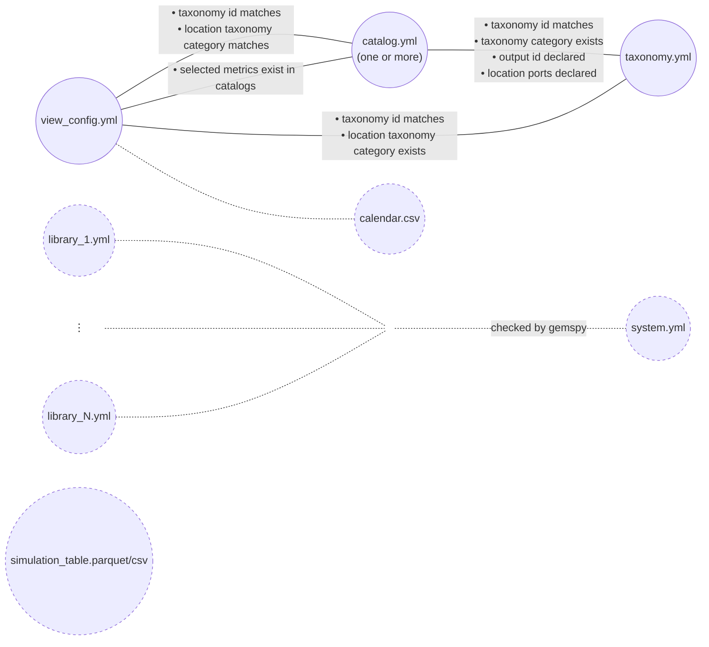

# GEMS-ViewsBuilder

This repository is a prototype for the GEMS BusinessViews builder. According to the GEMS logic, a View is an aggregated perspective on a SimulationTable.

## Inputs

The main inputs are
- A GEMS System
- A GEMS Library 
- A GEMS Taxonomy 
- A SimulationTable consistent with the GEMS System
- One or several Catalog(s) defining Metrics
- Configurations of Views

## Outputs

The main outputs are Views.

## Input validation diagram

[Input validation](docs/input_validation_diagram.md) for the detailed rules behind each check.

