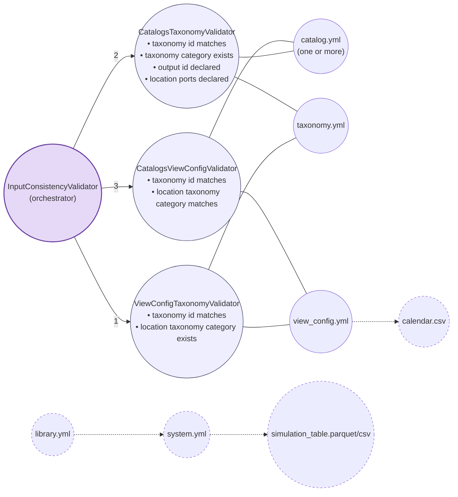

# Input Validation Diagram

Nodes are input files loaded by the pipeline, plus the orchestrator and
the validator classes it runs. Every validator node lists, in words, the
checks it performs, and connects to the orchestrator (run order) and to
the file(s) it reads.

Numbered edges out of the orchestrator show run order. Solid edges from a
validator to a file = that file's content is read/checked by the
validator. Dashed edges = files are read together / referenced by the
study layout, but have no dedicated cross-file validator yet (see
[`StudyLayoutValidator`](../gems_views_builder/validation/study_layout_validator.py),
which only checks that these files are *present*, not their contents).

## Edge details

### `catalog.yml` → `taxonomy.yml`
[`CatalogsTaxonomyValidator`](../gems_views_builder/validation/catalogs_taxonomy_validator.py)

| Check | Rule |
|---|---|
| Taxonomy id match | `catalog.taxonomy == taxonomy.id` |
| Taxonomy category exists | every term's `taxonomy-category` is a category defined in `taxonomy.yml` |
| Output id declared | every term's `output-id` is declared as a `variable` or `extra-output` on that category |
| Location ports declared | every term's `location-ports` are declared as `ports` on that category |

### `view_config.yml` → `taxonomy.yml`
[`ViewConfigTaxonomyValidator`](../gems_views_builder/validation/view_config_taxonomy.py)

| Check | Rule |
|---|---|
| Taxonomy id match | `view_config.taxonomy_id == taxonomy.id` |
| Location taxonomy category exists | `view_config.location_taxonomy_category` is a category defined in `taxonomy.yml` |

### `catalog.yml` → `view_config.yml`
[`CatalogsViewConfigValidator`](../gems_views_builder/validation/catalog_view_config_validator.py)

| Check | Rule |
|---|---|
| Taxonomy id match | `catalog.taxonomy == view_config.taxonomy_id` |
| Location taxonomy category match | `catalog.location_taxonomy_category == view_config.location_taxonomy_category` |

## Orchestration

[`InputConsistencyValidator`](../gems_views_builder/validation/input_consistency_validator.py)
runs all three edges above, in this order:

1. `ViewConfigTaxonomyValidator` (view_config ↔ taxonomy)
2. `CatalogsTaxonomyValidator` (catalog ↔ taxonomy)
3. `CatalogsViewConfigValidator` (catalog ↔ view_config)
